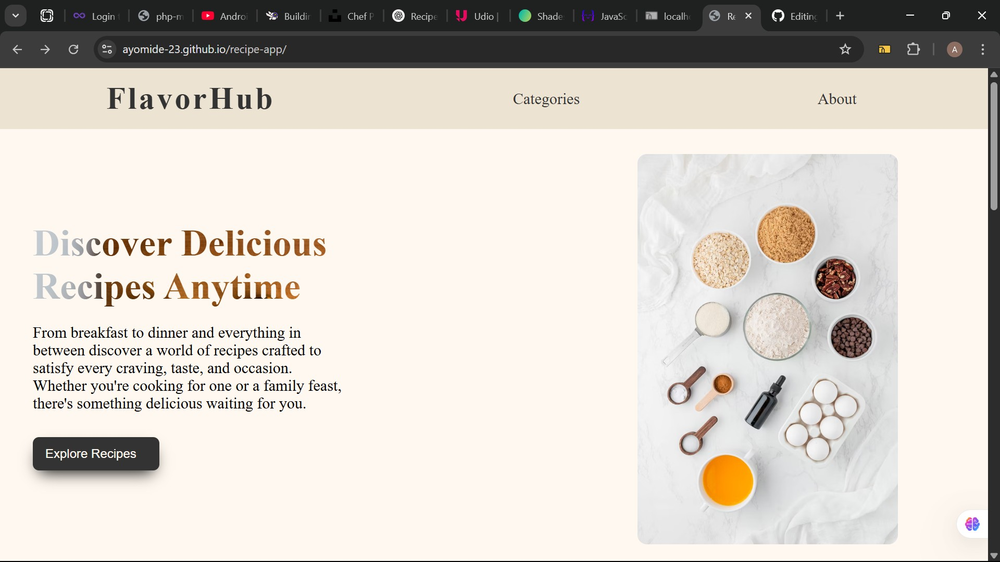
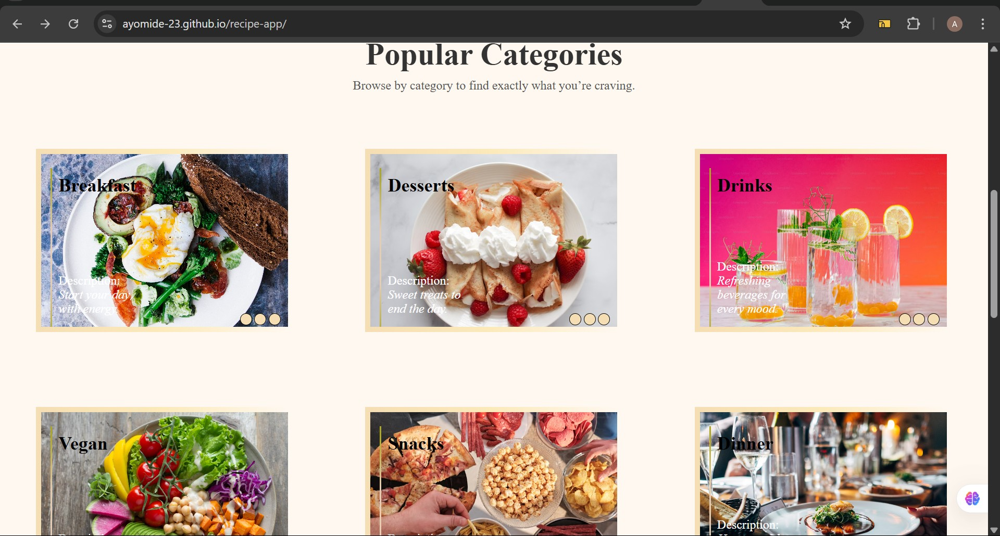

# 🍽️ Recipe App

A clean and interactive Recipe App built with React and CSS. Users can explore popular food categories, enjoy smooth hover effects, and get an insight into the app’s purpose through a modern, animated interface.

## 🔗 Live Demo

👉 [Click here to view the app](https://ayomide-23.github.io/recipe-app/)

## 🖼️ Screenshots

### Hero Section


### Popular Categories


## ✨ Features

- Responsive **Hero Section** with styled text and layout
- **Popular Categories** with background image transitions on hover
- **About Us Section** with animated layout and smooth experience
- Fully responsive UI using only **React and plain CSS**
- Deployed via **GitHub Pages**

## 🛠️ Tech Stack

- ⚛ React.js
- 🎨 CSS (no frameworks)
- 🌐 [Spoonacular API](https://spoonacular.com/food-api)
- 🧰 Git & GitHub

## 🚀 Installation

To run this project locally:

1. Clone the repository
```bash
git clone https://github.com/ayomide-23/recipe-app.git
